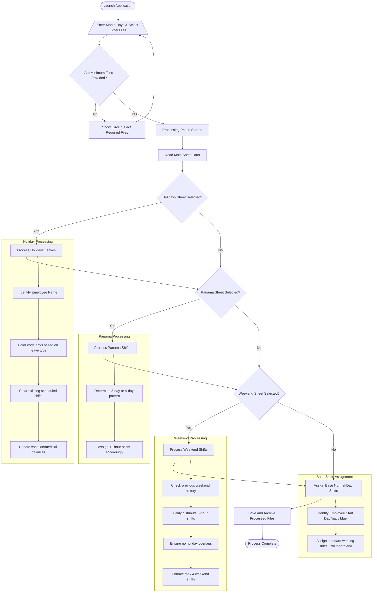

# Central Excel Controller (CEC) Process Flow

## Process Overview Flowchart

## Detailed Explicit Process Description

### 1. Application Initialization & Input Phase
* **Launch**: The user starts the JavaFX application.
* **Input Parameters**:
    * **Month Days**: The user enters the exact number of days for the current month (28-31).
    * **File Selection**: The user selects mandatory and optional Excel files:
        * **Fisierul Principal (Main Sheet)**: *Mandatory*. Contains the employee roster and daily schedules.
        * **Fisierul Vacante (Holidays Sheet)**: *Optional*. Contains employee periods of absence and leave types.
        * **Fisierul Munca Inegala (Panama Sheet)**: *Optional*. Contains uneven-work-week shift assignments.
        * **Fisierul Weekend (Weekend Sheet)**: *Optional*. Contains weekend availability.
* **Validation**: Upon clicking "Proceseaza Datele" (Process Data), the system checks if the Main Sheet and at least one other optional file are provided. If not, it halts and prompts the user.

### 2. Data Parsing & Holiday Processing
If the Holidays Sheet is provided, the system processes it first to ensure absences take priority:
* **Employee Matching**: The software matches names using a normalized comparison (ignoring accents and special characters).
* **Date Parsing**: The format `DD*DD` is parsed to find start and end dates.
* **Shift Clearing**: The system marks the respective calendar days with specific hex colors (e.g., Green for Vacation, Aqua for Medical, Red for Resignation). During this period, any pre-existing shifts are cleared.
* **Calculation**: Vacation days exclude weekends, while medical leaves count consecutively. The employee's available leave balances are updated at the end of the sheet.

### 3. Panama Shifts Processing
If the Panama Sheet is provided, the system applies the uneven shift rotation:
* **Pattern Assignment**: Automatically detects whether an employee is on a 4-day (Sunday) or 3-day (Friday) working variant using `X` markers.
* **Reverse Ordering**: It computes the schedules backward (reverse chronological order) to prevent overwriting prior days' logic.
* **Hour Allocation**: Places **11-hour** working values into the correct days on the Main Sheet. 

### 4. Weekend Shift Processing
If the Weekend Sheet is provided, weekend days are balanced among employees:
* **History Checking**: Checks if the employee worked the last Saturday of the preceding month, particularly critical if the current month begins on a Sunday.
* **Allocation Algorithm**: Iteratively assigns weekend shifts based on an intelligent algorithm balancing fairness, minimum coverage, and a hard cap of 4 weekend shifts per month.
* **Conflict Resolution**: Bypasses any weekend day that falls on an already processed Holiday/Vacation sequence.
* **Shift Writing**: Writes standard **8-hour** blocks for assigned weekend days, updating cumulative monthly tracking columns for weekend work versus holiday-weekend work.

### 5. Base Schedule Alignment
* **Start Day Tracking**: The algorithm looks for an initial start day (marked with a navy blue cell) representing the employee’s onboarding.
* **Normal Shift Filling**: Assigns standard daily work shifts from their specific start day through the end of the month, bridging gaps between weekends and skipping holidays.

### 6. Archiving & Finalization
* **Data Saving**: The manipulated data is written back to Excel standard structures.
* **Auto-Archive**: The freshly processed Main Excel file (along with its state) is moved/copied to a local directory named `arhiva`.
* **Completion**: The process terminates successfully, informing the user that the schedule is updated and safely backed up.
